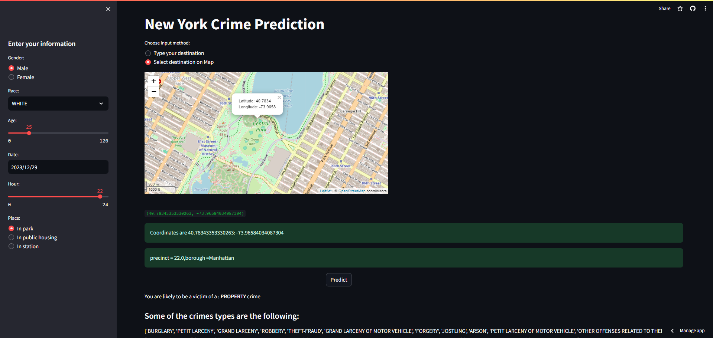

<h1 align="center">
  <br>
  New York City Crimes Detection using Machine Learning

</h1>

<div align="center">
  <h4>
    <a href="#Overview">Overview</a> |
    <a href="#dataset">Dataset</a> |
    <a href="#notebooks">Notebooks</a> |
    <a href="#technologies">Technologies</a> |
    <a href="#User Interface">User Interface</a>|
    <a href="#paper">Paper</a>
  </h4>
</div>

<br>

## Overview

Predicting crime probabilities is crucial for enhancing public safety measures. Our machine learning-based web application leverages historical crime data in New York City to provide users with valuable insights into potential crime occurrences. By incorporating user-specific information, location, and time, the application assists individuals in making informed decisions and taking preventive actions. Whether planning a route, selecting a residential area, or simply staying aware of potential risks, our tool empowers users with a proactive approach to personal safety.

## Dataset

This work relies on [NYPD Complaint Data Historic Dataset](https://data.cityofnewyork.us/Public-Safety/NYPD-Complaint-Data-Historic/qgea-i56i). This dataset includes all valid felony, misdemeanor, and violation crimes reported to the New York City Police Department (NYPD) from 2006 to 2021. The dataset contains 6901167 complaints and 35 columns including spatial and temporal information about crime occurrences along with their description and penal classification.

## Notebooks

Different notebooks are provided for :
- [Data cleaning & Exploratory Data Analysis](https://github.com/Ahmed-BS11/NYC_Crime_prediction/blob/main/notebooks/ny-crimes-data-cleaning-eda.ipynb)
- [data Preparation & Modeling](https://github.com/Ahmed-BS11/NYC_Crime_prediction/blob/main/notebooks/data-preparation-modeling.ipynb)

## Technologies

This web application is developd using:
- Streamlit
- Folium
- geopy
- geopandas
- shapely

For data cleaning, EDA and modeling:
- Pandas
- seaborn
- matplotlib
- Scikit-learn
- lightgbm
- xgboost
- catboost

To install requirements run:
```sh
pip install -r requirements.txt
```

## User Interface

Explore the [web application](https://nyc-crime-prediction.streamlit.app/) to interact with crime prediction interfaces.

Here's an example of the interface:


## Paper

To document our work, we wrote a research paper that is included in the [repo](https://github.com/Ahmed-BS11/NYC_Crime_prediction/blob/main/docs/nyc_crimes_prediction_paper.pdf).
